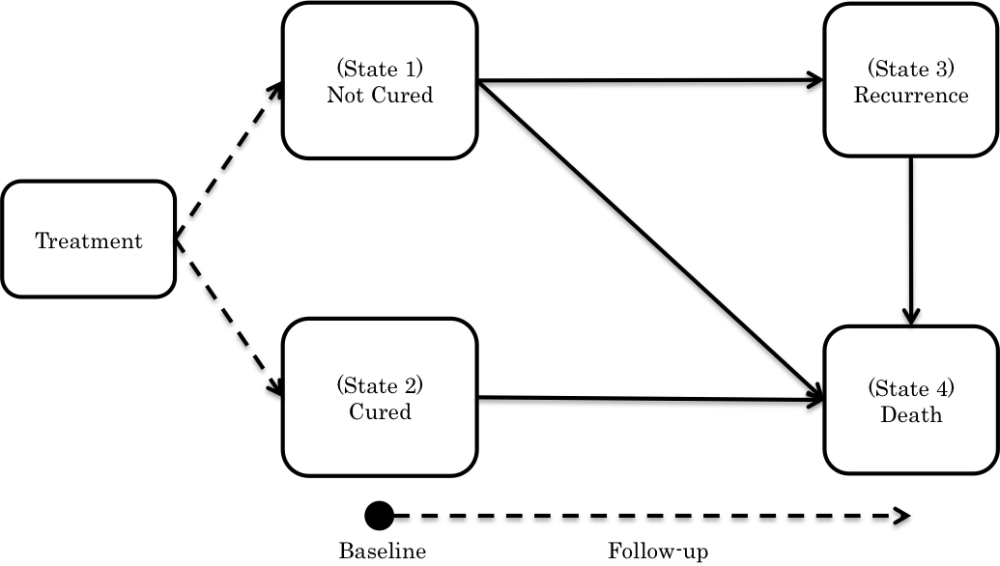

In this vignette, we provide a brief introduction to using the R package *MultiCure* to fit multistate cure models. We will not include technical details about the multistate cure model or the model fitting algorithms here. We will generally note that this R package includes two different model fitting algorithms: the EM algorithm and the Monte Carlo EM algorithm. The EM algorithm is used for fitting the multistate cure model when we have missingness in partially latent cure status but have no other sources of missingness. The Monte Carlo EM algorithm was developed to handle two additional sources of missingness: missingness in the covariates and missingness in the outcome information related to having unequal follow-up for the two outcome events. This latter form of missingness is common in the setting where the outcomes of interest are recurrence and death. For additional details about the estimation algorithm, we refer the reader to Beesley et al. (2019) in *Biostatistics*. [link to paper](https://academic.oup.com/biostatistics/article-lookup/doi/10.1093/biostatistics/kxy011)


## Multistate Cure Model Structure
For details about the multistate cure model structure, see @Conlon2014. Here, we will just list basic details. **Figure 1** shows the structure of the multistate cure model used in this package. We note that the outcome events may be events other than recurrence and death, but we will use these events as examples. 
```{r, echo=FALSE, fig.cap="Figure 1: Multistate Cure Model Structure", out.width = '80%'}

library(MultiCure)
```

&nbsp;

We model the probability of not being cured by initial treatment using logistic regression: 
$$\text{logit}(P(\text{ Not Cured } = 1 \vert \text{ Covariates } X_i) )= \alpha_0 + \alpha_1^T X_i$$ 
We model the transition rate from state $j$ to state $k$ for all transitions except $3 \rightarrow 4$ using proportional hazards model: 
$$\lambda_{jk}(t) = \lambda^0_{jk}(t) \exp(\beta_{jk}^T X_{i})$$
In the model for the $3 \rightarrow 4$ transition, we use the ``clock reset" method in which time is reset to zero upon entering state 3, and use a proportional hazards regression to model the residual time in state 3 before entering state 4 as follows: 
$$ \lambda_{34}(t - T_{ir}) = \mathbb{I}(t > T_{ir}) \lambda^0_{34}(t - T_{ir}) \exp(\beta_{34}^T X_{i})$$
where $T_{ir}$ is the time of recurrence. We can incorporate the time spent in state 1, $T_{ir}$, as a covariate in $X_{i}$ for this transition if desired. We may use parametric or nonparametric forms for the baseline hazards.\\
\indent Let $\Lambda_{jk}(t)$ and $\Lambda^0_{jk}(t)$ represent the cumulative hazard and cumulative baseline hazard for transition $j \rightarrow k$. We consider several possible restrictions on the baseline hazards for the $2 \rightarrow 4$ and $1 \rightarrow 4$ transitions, which may typically represent death from other causes. It may be reasonable to assume that the hazards are identical ($\Lambda_{14}(t) = \Lambda_{24}(t)\ \forall \ t \geq 0$). In this case, the multistate cure model reduces to a CPH cure model for recurrence time with two additional regressions for time to death with and without recurrence @Conlon2014. We may also assume the hazards are proportional ($\Lambda_{14}(t) = \Lambda_{24}(t) \exp\{\beta_0\}$) or that the baseline hazards are equal ($\Lambda^0_{14}(t) = \Lambda^0_{24}(t)$, $\beta_{24}$ and $\beta_{14}$ unrestricted), or we may make no equality assumptions ($\Lambda_{14}(t)$ and $\Lambda_{24}(t)$ unrestricted). 


## Model Fitting Software
We simulate data under a multistate cure model with two multivariate normal covariates with 1) no covariate missingness or unequal censoring, 2) covariate missingness, and 3) unequal censoring
```{r, echo = TRUE, eval = TRUE}
NONE = SimulateMultiCure(type = 'NoMissingness') 
COV = SimulateMultiCure(type = 'CovariateMissingness')
CENS = SimulateMultiCure(type = 'UnequalCensoring')
```

Below, we estimate the Kaplan-Meier curve for time to recurrence and time to death for this example dataset. 
```{r, echo = FALSE, eval = TRUE,  fig.width = 7, fig.height= 4}
library(survival)
par(mfrow = c(1,2))
plot(survfit(Surv(NONE$Y_R, NONE$delta_R)~1), mark.time = T, main = 'Time to Recurrence', xlab = 'Years', ylab = 'Event-Free Probability', cex.main = 0.8)
plot(survfit(Surv(NONE$Y_D, NONE$delta_D)~1), mark.time = T, main = 'Overall Survival', xlab = 'Years', ylab = 'Event-Free Probability', cex.main = 0.8)
```

We note that, since recurrence and death from other causes are competing events, the Kaplan-Meier estimate for time to recurrence does not represent the true recurrence rate in the population. However, we can use this Kaplan-Meier plot to evaluate when during follow-up the recurrences are occurring. In order for the proposed methods to perform well, we need to have sufficient follow-up for both recurrence and death. In particular, the Kaplan-Meier plot for recurrence needs to plateau, and we may suppose that subjects at risk after some late follow-up time (eg. 50 in this example) are cured.  

The function **MultiCure** performs the proposed EM or MCEM algorithms in order to estimate $\theta$. The form of the baseline hazard functions is specified by the argument *BASELINE* and can take values 'weib' for Weibull baseline hazards or 'cox' for Cox baseline hazards. The restrictions on the $1 \rightarrow 4$ and $2 \rightarrow 4$ hazards can be specified with the argument *ASSUME*. Possible options include 'SameHazard' $(\Lambda_{14}(t) = \Lambda_{24}(t))$, 'SameBaseHaz' $(\Lambda^0_{14}(t) = \Lambda^0_{24}(t))$, 'ProportionalHazard' $(\Lambda_{14}(t) = e^{\beta_0} \Lambda_{24}(t))$, and `AllSeparate' (no restrictions).   

First, we need to put the data into the correct format. We create a data frame *datWIDE* containing the following variables: 'Y\_R' = recurrence event/censoring time,  'delta\_R' = recurrence event/censoring indicator, 'Y\_D' = death event/censoring time,  'delta\_D' = death event/censoring indicator, 'G' = non-cure status (NA if unknown, 1 if recurrence, 0 if assumed cured). We also create a data frame *Cov* containing the covariates we want to use in the model fit. We then create list *TransCov* to denote which covariates we want to include in which transition. *TransCov* contains elements 'Trans13', 'Trans24',  'Trans14', 'Trans34', and 'PNonCure'. Each element is a character vector containing the names of the covariates in *Cov* to be used in the model for each transition. If we wish to include no covariates in the model for a particular transition, we can include an all-zero covariate in *Cov* and list this covariate in *TransCov*. In our illustrative example, we will include both covariates in all parts of the multistate cure model. 


## Fitting the Multistate Cure Model using an EM Algorithm

We first consider the setting with fully-observed coveriates and equal follow-up for all subjects. Suppose we want to fit a multistate cure model to the complete data assuming Weibull baseline hazards and equal $1 \rightarrow 4$ and $2 \rightarrow 4$ hazards.  We can perform the proposed EM algorithm to fit the multistate cure model in R as follows:
```{r, echo = TRUE, eval = FALSE}
### Prepare Data
Cov = data.frame(X1 = NONE$X1,X2 = NONE$X2)
VARS = names(Cov)
TransCov = list(Trans13 = VARS, Trans24 = VARS, Trans14 = VARS, Trans34 = VARS, PNonCure = VARS)
datWIDE = data.frame( Y_R = NONE$Y_R, Y_D = NONE$Y_D, delta_R = NONE$delta_R , 
          delta_D = NONE$delta_D, G = NONE$G)

### Fit Model
fit = MultiCure(iternum = 50, datWIDE, Cov, ASSUME = 'SameHazard', TransCov=TransCov, 
          BASELINE = 'weib')
OUT = VarianceEM(fit,iternum=20, bootnum=50, datWIDE, Cov, ASSUME = 'SameHazard', TransCov=TransCov, 
          BASELINE = 'weib')
```
Object *fit* will be a list containing the parameter estimates at the final iteration and the estimates at all previous iterations. Argument *iternum* indicates the number of iterations the algorithm will perform. We can alternatively fit the same model using non-parametric baseline hazards by specifying BASELINE = 'cox'. We can examine the parameter estimates across iterations to evaluate the model convergence. The function \textbf{VarianceEM} performs variance estimation using bootstrap methods when no covariate missingness or unequal follow-up is present. The argument *bootnum* corresponds to the number of bootstrap samples, and *iternum* corresponds to the number of iterations of the EM algorithm used for each bootstrap sample. The object *OUT* is a data frame containing the variance estimates for each model parameter. 


## Fitting the Multistate Cure Model using an MCEM Algorithm

Suppose instead that we impose missingness in the second covariate. Then, we can fit a multistate cure model using the proposed MCEM algorithm using **MultiCure** with additional arguments. The MCEM algorithm involves imputing values for the missing covariate at each iteration of the model fitting algorithm, and the user must specify a function **COVIMPUTEFUNCTION** for performing this imputation. The user-specified function must have the following arguments: 'datWIDE', 'param', 'ImputeDat', and 'TransCov'. When the user-specified function is called within **MultiCure**, these take the following values: 
 (1) *datWIDE*: this is the same as in **MultiCure**
 (2) *param*: a vector containing the most recent model parameters. 
 (3) *ImputeDat*: a list with elements [[1]], a binary vector taking value 1 if subject has unequal follow-up; [[2]], a binary matrix taking value 1 if the corresponding element of *Cov* is missing. The list also contains *single* imputations of *Cov*, $G$, $Y_R$, and $\delta_R$ from the previous iteration in slots [[3]]-[[6]] respectively. If *BASELINE* = 'cox' in **MultiCure**, this list will also contain the most recent estimate of the baseline hazards for each transition.
(4) *TransCov*: this is the same as in **MultiCure**

**COVIMPUTEFUNCTION** must return a data frame containing a *single* imputation of *Cov*. The user can use any method he/she wants to perform the imputation. In the main paper, we use a method similar to the method proposed in @Bartlett2014. Alternatively, the user could call the function *mice* (from package mice in R) or another standard imputation software within **COVIMPUTEFUNCTION**.

The user must also specify a function **COVIMPUTEINITIALIZE** for initializing the missing values of *Cov*. This has argument *Cov* (same as **MultiCure**) and *CovMissing* (binary matrix taking value 1 if corresponding element of *Cov* is missing). This function must return a single initialized version of *Cov*. We can then fit a multistate cure model using the following:

```{r, echo = TRUE, eval = FALSE}
### Prepare Data
Cov = data.frame(X1 = COV$X1, X2 = COV$X2)
VARS = names(Cov)
TransCov = list(Trans13 = VARS, Trans24 = VARS, Trans14 = VARS, Trans34 = VARS, PNonCure = VARS)
datWIDE = data.frame( Y_R = COV$Y_R, Y_D = COV$Y_D, delta_R = COV$delta_R , 
          delta_D = COV$delta_D, G = COV$G)

### Obtain Point Estimates
fit = MultiCure(iternum = 200, datWIDE, Cov, COVIMPUTEFUNCTION_Example, COVIMPUTEINITIALIZE_Example,  
          IMPNUM = 10,ASSUME = 'SameHazard', TransCov = TransCov, BASELINE = 'weib')
beta = apply(fit[[5]][,190:200], 1, mean)

### Variance Estimation
OUT = VarianceMCEM(fit,var_method = 'default', datWIDE = datWIDE,  ASSUME = 'SameHazard', 
          TransCov = TransCov, BASELINE = 'weib', COVIMPUTEFUNCTION = COVIMPUTEFUNCTION_Example, 
          COVIMPUTEINITIALIZE = COVIMPUTEINITIALIZE_Example, POSTITER = 5)	
```

The argument *IMPNUM* is an integer corresponding to the number of imputed datasets to obtain. As before, object *fit* will be a list containing the parameter estimates at the final iteration and the estimates at all previous iterations. It will also contain the imputed version of the data at the final iteration. We can again examine the parameter estimates across iterations to evaluate the model convergence. We can obtain an estimate of $\theta$ by taking the mean of the parameter estimates from the last few iterations of the MCEM algorithm. In order to estimate the standard errors, we first perform a post-processing step that converts the "improper" imputed data from the MCEM algorithm into "proper" imputations as defined in @Little2002. We can then estimate the standard errors overall by estimating the standard errors separately for each imputed dataset and then using Rubin's rules to obtain the overall standard errors. Within each imputed dataset, we can estimate standard errors using software to fit proportional hazards and logistic regression models (var_method = 'default') or using bootstrap methods (var_method = 'bootstrap'). This function also provides a different estimate of Theta based on Rubin's rules (based only on the final iteration). We have found the estimate from the mean of the last few iterations (above) may have slightly better coverage unless the number of imputations is large.

Our data may also have unequal censoring of the recurrence and death times. In this case, we can apply an imputation strategy to deal with the missingness. Several functions are provided in this package to accomplish this task. The differences between these various methods are described in detail in the Supplementary Materials to Beesley et al. (2019). [link to paper](https://academic.oup.com/biostatistics/article-lookup/doi/10.1093/biostatistics/kxy011) For example, one could handle this unequal censoring for a model assuming Weibull baseline hazards using the following: 
```{r, echo = TRUE, eval = FALSE}
### Prepare Data
Cov = data.frame(X1 = CENS$X1, X2 = CENS$X2)
VARS = names(Cov)
TransCov = list(Trans13 = VARS, Trans24 = VARS, Trans14 = VARS, Trans34 = VARS, PNonCure = VARS)
datWIDE = data.frame( Y_R = CENS$Y_R, Y_D = CENS$Y_D, delta_R = CENS$delta_R, 
          delta_D = CENS$delta_D, G = CENS$G)

### Obtain Point Estimates
fit = MultiCure(iternum = 200, datWIDE  = datWIDE, Cov = Cov, IMPNUM = 10,
          ASSUME = 'SameHazard', TransCov = TransCov, BASELINE = 'weib', 
          UNEQUALCENSIMPUTE = UNEQUALCENSIMPUTEWEIBREJECTION)

### Variance Estimation
OUT = VarianceMCEM(fit,var_method = 'default', datWIDE = datWIDE,  ASSUME = 'SameHazard', 
          TransCov = TransCov, BASELINE = 'weib', UNEQUALCENSIMPUTE = UNEQUALCENSIMPUTEWEIBREJECTION, 
          POSTITER = 5)
```


## Estimating State Occupancy Probabilities
We have also developed an application for estimating the state occupancy probabilities over time given user-specified baseline covariate values based on a multistate cure model fit. We provide estimates 1) incorporating baseline covariates only and 2) incorporating baseline covariates and some post-baseline followup (except when we have Cox baseline hazards and fit using the MCEM algorithm). For a given set of baseline covariates (and potentially some post-baseline follow-up) and a particular time $t$, we estimate the state occupancy probability. Similar estimates for the overall survival probability and the event-free probability are also provided. The plots produced by the application can be downloaded to the working directory. Several versions of this application are provided based on the assumptions made in the multistate modeling.

### Weibull Baseline Hazards
Suppose first that the multistate cure model was fit assuming Weibull baseline hazards. We can run the RShiny app using the following code:
```{r, echo = TRUE, eval = FALSE}
STATEOCCUPANCYWEIB(times = seq(0,max(datWIDE$Y_D),1), TransCov, 
          newCov = data.frame(X1 = c(0,0.5), X2 = c(0,0.5)), beta = fit[[1]], alpha = fit[[2]], 
          scale = fit[[3]], shape = fit[[4]]) 
```
where *times* is a vector of the times at which the probabilities should be estimated, *TransCov* is the same as before, and *newCov* is a data frame containing the covariate values we want to make predictions for. The structure of *newCov* should match the structure of *Cov* from the multistate cure model fit. *beta*, *alpha*, *scale*, and *shape* are the estimated parameter values from the multistate cure model fit.


### Cox (Non-parametric) Baseline Hazards, Fit using EM Algorithm
Suppose next that the multistate cure model was fit assuming Cox baseline hazards and using data that had no missing covariates or unequal censoring. We can run the corresponding RShiny app using the following code:
```{r, echo = TRUE, eval = FALSE}
Haz = BaselineHazard_NOIMP(datWIDE, Cov, beta = fit[[1]], alpha = fit[[2]], TransCov, ASSUME = 'SameHazard', p = fit[[5]]) 
STATEOCCUPANCYCOX_NOIMP(times = seq(0,max(datWIDE$Y_D),1), TransCov, 
          newCov = data.frame(X1 = c(0,0.5), X2 = c(0,0.5)), beta = fit[[1]], alpha = fit[[2]], 
          Haz_13 = Haz[[1]], Haz_24 = Haz[[2]], Haz_14 = Haz[[3]], Haz_34 = Haz[[4]]) 
```
Here, the function **BaselineHazard\_NOIMP** provides the estimate for the cumulative baseline hazard function for each transition at the final iteration of the EM algorithm. We use these cumulative hazards to estimate the state occupancy probabilities.*beta* and *alpha* are the estimated parameter values from the multistate cure model fit, and *TransCov*, *Cov*, and *ASSUME* are the same as in **MultiCure**. *newCov* is a data frame containing the covariate values we want to make predictions for. The structure of *newCov* should match the structure of *Cov* from the multistate cure model fit. 


## References
